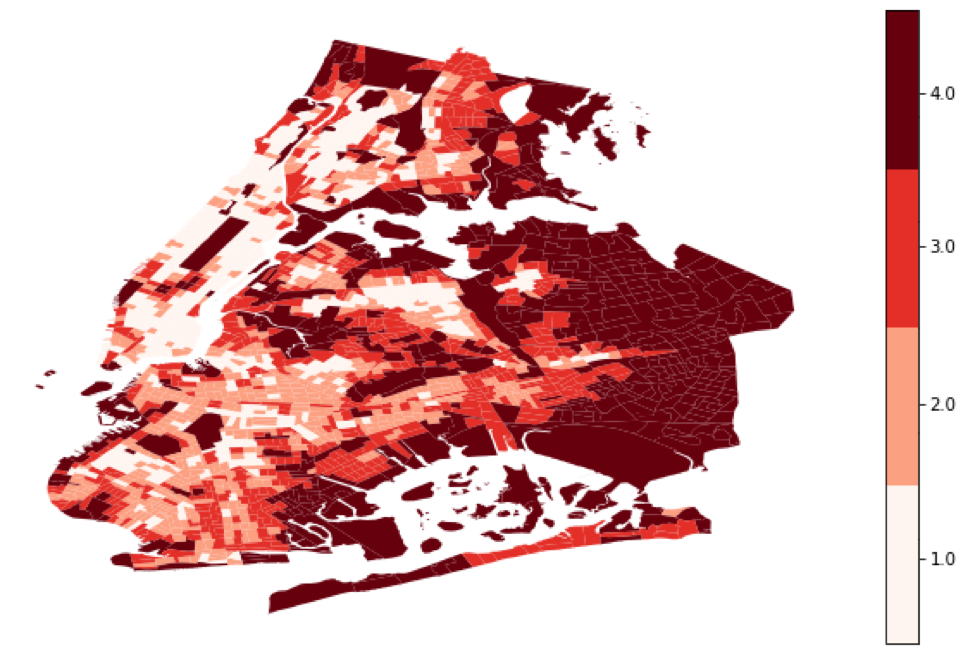
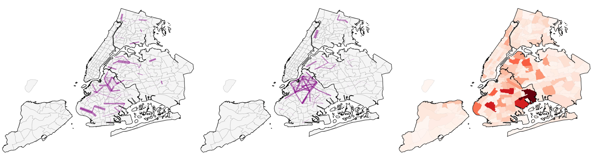
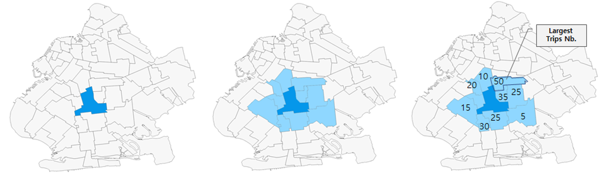
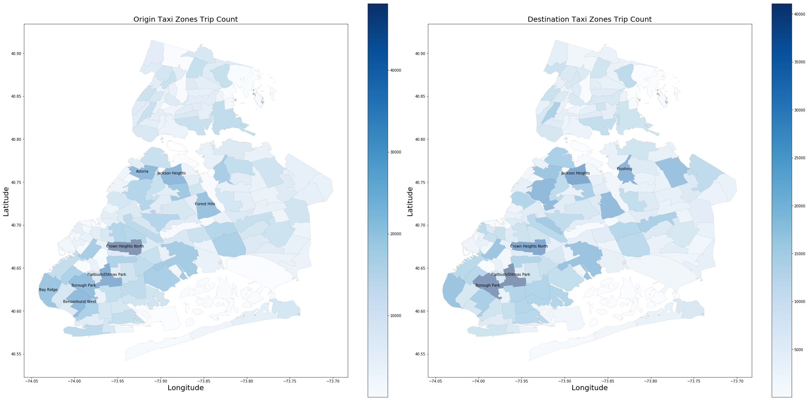
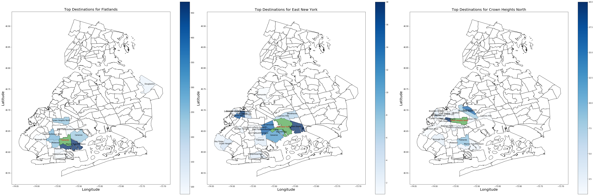

# Capstone 2019 Dollaride Repo

 While New York City has developed public transportation networks provided by MTA, a huge number of people living in outer boroughs are left outside the networks. These people are living in “transit deserts” and have a strong demand for transportation means. Part of the demand is met by so-called “dollar vans” – a chain of thousands of privately owned commuter vans which run across the NYC. A startup called “Dollaride” connects drivers and passengers in these marginalized communities using an  innovative transportation technology.
The project identifies methodology for calculating transit deserts (transit-underserved areas in terms of specific transit supply-demand equilibrium) in a large city. The methodology is based on earlier developed attitude by Jiao and Dillivan (2013), but some different parameters characterising a first-tier American city were suggested.  The outcome of the project is a map of transit deserts in NYC, based on a solid quantitative analysis and data. Another practical implication of the project is a list of new routes for Dollaride, which would benefit its passengers, drivers and NYC transportation authorities. 

## Transit Desert
- Transit desert is obtained by calculating index based on census tract.

## For Hire Vehicles (FHV)
- NYC OpenData offers yearly FHV data.
- Due to the size of the data, I used Postgresql to minimize memory usage.
- This map shows the for-hire-vehicle trips during the weekdays between different taxi zones within Queens, Brooklyn, Bronx, Staten Island, and Newark airport. 
- The purple lines shown on the map represent the trips between different zones that have more than 100 trip counts, which can be regarded as popular routes for for-hire-vehicles on a taxi zone basis.
- The wider the purple band is, the more trips there are on that route. For example, the trips between Jackson Heights and Astoria, Williamsburg and Bed-Stuy, as well as Bay Ridge and Bath Beach have large volume of trips represented by the wide stroke of purple bands. 

Figure: weekday trips; weekend trips; internal trips;
## Route suggestion
- Suggested routes map are in the routes_map directory.
- The methodology is as follows:

## Synthetic Population
-
- 

